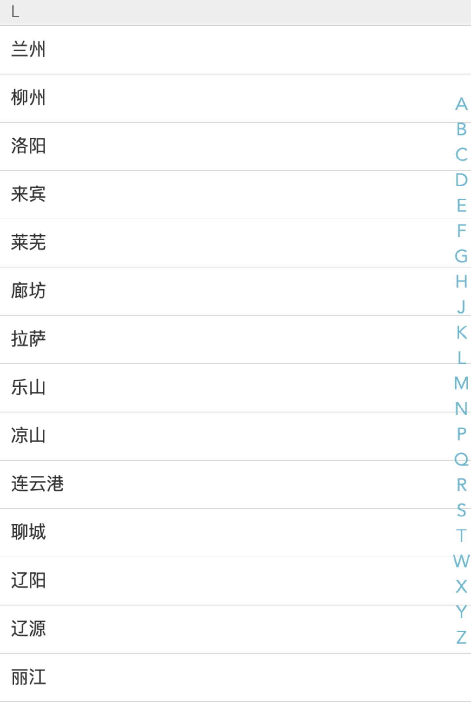

# 字母表下拉关键代码
---

<br/><br/><br/>

```
handleTouchStart() {
    this.touchStatus = true
},
handleTouchMove(e) {
    if(this.touchStatus) {
        const startY = this.$refs['A'][0].offsetTop;
        const touchY = e.touches[0].clientY - 79;
        const index = Math.floor((touchY - startY) / 20);
        if(index >= 0 && index < this.letters.length) {
            this.$emit('change', this.letters[index]);
        }
    }
},
handleTouchEnd() {
    this.touchStatus = false
}

```