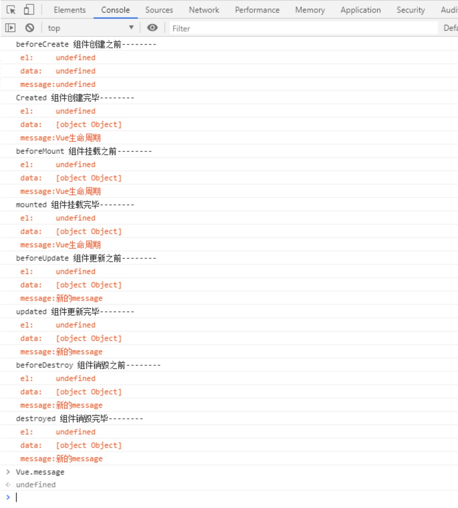

# Vue生命周期
---
```
<!DOCTYPE html>
<html lang="en">
<head>
    <meta charset="UTF-8">
    <title>Vue生命周期</title>
    <script src="https://cdn.staticfile.org/vue/2.4.2/vue.min.js"></script>
</head>
<body>
<div id="app">
    <h3>外部template:{{message}}</h3>
</div>

<script>
    new Vue({
        el: '#app',
        data() {
            return {
                message: 'Vue生命周期'
            }
        },
        template: '<div><p>内部template:{{message}}</p></div>',
        //组件创建之前
        beforeCreate() {
            console.log('beforeCreate 组件创建之前--------');
            console.log('%c el:     ' + this.el, 'color:#f40;');
            console.log('%c data:   ' + this.$data, 'color:#f40;');
            console.log('%c message:' + this.message, 'color:#f40;');
        },
        //组件创建完毕
        created() {
            console.log('Created 组件创建完毕--------');
            console.log('%c el:     ' + this.el, 'color:#f40;');
            console.log('%c data:   ' + this.$data, 'color:#f40;');
            console.log('%c message:' + this.message, 'color:#f40;');
            // this.$mount('#app')   //创建后手动挂载el

        },
        //组件挂载之前
        beforeMount() {
            console.log('beforeMount 组件挂载之前--------');
            console.log('%c el:     ' + this.el, 'color:#f40;');
            console.log('%c data:   ' + this.$data, 'color:#f40;');
            console.log('%c message:' + this.message, 'color:#f40;');
        },
        //组件挂载完毕
        mounted() {
            console.log('mounted 组件挂载完毕--------');
            console.log('%c el:     ' + this.el, 'color:#f40;');
            console.log('%c data:   ' + this.$data, 'color:#f40;');
            console.log('%c message:' + this.message, 'color:#f40;');
            this.message = '新的message';   //更新message触发beforeUpdate，updated
        },
        //组件更新之前
        beforeUpdate() {
            console.log('beforeUpdate 组件更新之前--------');
            console.log('%c el:     ' + this.el, 'color:#f40;');
            console.log('%c data:   ' + this.$data, 'color:#f40;');
            console.log('%c message:' + this.message, 'color:#f40;');
        },
        //组件更新完毕
        updated() {
            console.log('updated 组件更新完毕--------');
            console.log('%c el:     ' + this.el, 'color:#f40;');
            console.log('%c data:   ' + this.$data, 'color:#f40;');
            console.log('%c message:' + this.message, 'color:#f40;');
            this.$destroy();
        },
        //组件销毁之前
        beforeDestroy() {
            console.log('beforeDestroy 组件销毁之前--------');
            console.log('%c el:     ' + this.el, 'color:#f40;');
            console.log('%c data:   ' + this.$data, 'color:#f40;');
            console.log('%c message:' + this.message, 'color:#f40;');
        },
        //组件销毁完毕
        destroyed() {
            console.log('destroyed 组件销毁完毕--------');
            console.log('%c el:     ' + this.el, 'color:#f40;');
            console.log('%c data:   ' + this.$data, 'color:#f40;');
            console.log('%c message:' + this.message, 'color:#f40;');
        }
    })
</script>
</body>
</html>

```
---
执行结果：<br/><br/>


在Created和beforeMount之间，即组件创建完毕后，Vue会查看有没有el选项，如果没有，生命周期直接中断，这里可以选择用this.$mount('#app')手动挂载。如果有el选项，继续查看有没有template，template可以写在Vue实例内或者实例外，内外都有则会优先使用内部template。
