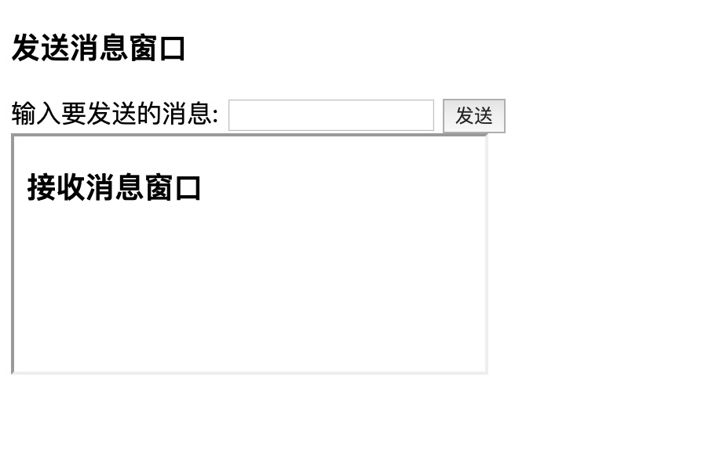
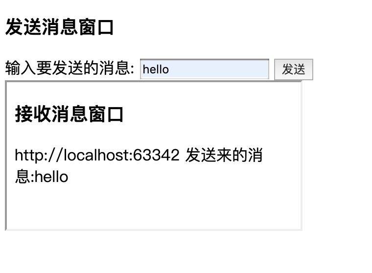

### postMessage
---
window.postMessage()方法可以安全地实现Window对象之间的跨域通信。
例如，在一个页面和它生成的弹出窗口之间，或者是页面和嵌入其中的iframe之间。

#### 发送消息
```javascript
targetWindow.postMessage(message, targetOrigin, [transfer]);
```
#### targetWindow
targetWindow就是接收消息的窗口的引用。获得该引用的方法包括： <br>
**·** Window.open <br>
**·** Window.opener <br>
**·** HTMLIFrameElement.contentWindow <br>
**·** Window.parent <br>
**·** Window.frames +索引值 <br>


#### contentDocument属性:
能够以 HTML 对象来返回 iframe 中的文档。

#### 发送端:http://localhost:63342/interview/11-5/js/parent.html?_ijt=t2cfldd936cdjrhvig02mp19m1
```html
<!DOCTYPE html>
<html lang="en">
<head>
    <meta charset="UTF-8">
    <title>发送端</title>
</head>
<body>
<div>
    <h3>发送消息窗口</h3>
    <div>
        <label for="msg">输入要发送的消息:</label>
        <input type="text" id="msg" name="msg" value="">
        <button id="button">发送</button>
    </div>
    <iframe src="http://localhost:8081/child.html" id="child"></iframe>
</div>

<script>
    const btn = document.getElementById('button');
    const child = document.getElementById('child').contentWindow;

    btn.addEventListener('click', () => {
        const msg = document.getElementById('msg').value;
        child.postMessage(msg, 'http://localhost:8081/child.html');
        console.log('发送成功');
    })
</script>
</body>
</html>
```
#### 接收端:http://localhost:8081/child.html
```html
<!DOCTYPE html>
<html lang="en">
<head>
    <meta charset="UTF-8">
    <title>接收端</title>
</head>
<body>
<div id="child">
    <h3>接收消息窗口</h3>
    <div id="msg"></div>
</div>
<script>
    window.addEventListener('message', (e) => {
        const msg = document.getElementById('msg');
        if(event.origin === 'http://localhost:63342') {
            msg.innerHTML = `${e.origin} 发送来的消息:${e.data}`;
        }
    })
</script>
</body>
</html>
```

#### 发送前：

#### 发送后：



[参考]<https://www.jianshu.com/p/62f1c080748a>