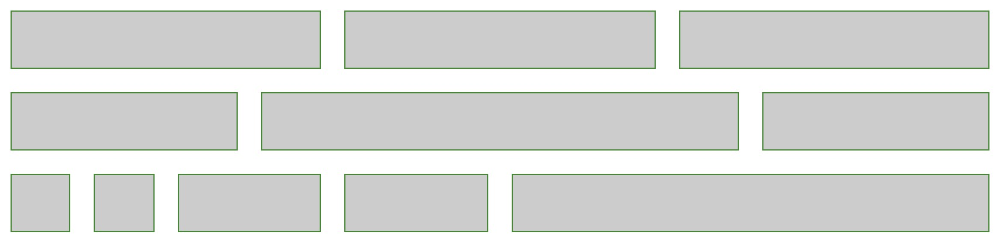
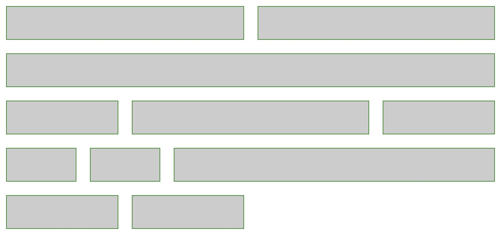

# 栅格
---
#### demo
大于768px时：

  
小于等于768px时：

```html
<!DOCTYPE html>
<html lang="en">
<head>
    <meta charset="UTF-8">
    <title>栅格</title>
    <style>
        * {
            margin: 0;
            padding: 0;
        }
        .app {
            font-size: 0;
        }
        .app div {
            box-sizing: border-box;
            display: inline-block;
            margin: 10px;
            height: 50px;
            border: 1px solid forestgreen;
            background: #ccc;
        }
        @media (min-width: 769px) {
            .col-md1  {width: calc(8.3333% - 20px)}
            .col-md2  {width: calc(16.66% - 20px)}
            .col-md3  {width: calc(25% - 20px)}
            .col-md4  {width: calc(33.3333% - 20px)}
            /*.col-md5  {width: 41.66%}*/
            .col-md6  {width: calc(50% - 20px)}
            /*.col-md7  {width: 58.33%}*/
            /*.col-md8  {width: 66.66%}*/
            /*.col-md9  {width: 75%}*/
            /*.col-md10 {width: 83.33%}*/
            /*.col-md11 {width: 91.66%}*/
            /*.col-md12 {width: 100%}*/
        }
        @media (max-width: 768px) {
            /*.col-sm1  {width: 8.33%}*/
            .col-sm2  {width: calc(16.6666% - 20px)}
            .col-sm3  {width: calc(25% - 20px)}
            /*.col-sm4  {width: 33.33%}*/
            /*.col-sm5  {width: 41.66%}*/
            .col-sm6  {width: calc(50% - 20px)}
            /*.col-sm7  {width: 58.33%}*/
            .col-sm8  {width: calc(66.6666% - 20px)}
            /*.col-sm9  {width: 75%}*/
            /*.col-sm10 {width: 83.33%}*/
            /*.col-sm11 {width: 91.66%}*/
            .col-sm12 {width: calc(100% - 20px)}
        }
    </style>
</head>
<body>
<div class="app">
    <div class="col-md4 col-sm6"></div>
    <div class="col-md4 col-sm6"></div>
    <div class="col-md4 col-sm12"></div>
    <div class="col-md3 col-sm3"></div>
    <div class="col-md6 col-sm6"></div>
    <div class="col-md3 col-sm3"></div>
    <div class="col-md1 col-sm2"></div>
    <div class="col-md1 col-sm2"></div>
    <div class="col-md2 col-sm8"></div>
    <div class="col-md2 col-sm3"></div>
    <div class="col-md6 col-sm3"></div>
</div>
<script>
    window.onresize = function () {
        console.log(document.body.offsetWidth)
    }
</script>
</body>
</html>
```
