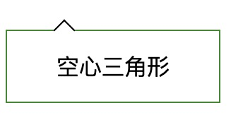

# 伪元素相关
---

### 1.空心三角形
原理：设置两条边框，再旋转，再定位
```html
<!DOCTYPE html>
<html lang="en">
<head>
    <meta charset="UTF-8">
    <title>transform实现空心三角形</title>
    <style>
        .b1 {
            position: relative;
            margin-top: 50px;
            width: 150px;
            height: 50px;
            text-align: center;
            border: 1px solid forestgreen;
            line-height: 50px;
        }
        .b1::before {
            content: '';
            display: inline-block;
            width: 10px;
            height: 10px;
            border-top: 1px solid #000;
            border-left: 1px solid #000;
            transform: rotate(45deg);
            position: absolute;
            background: #fff;
            top: -6px;
        }
    </style>
</head>
<body>
<div class="b1">
    空心三角形
</div>
</body>
</html>
```
#### 实现效果
